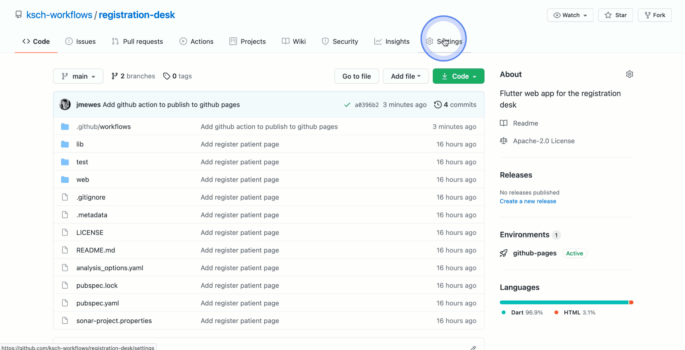

This blog post describes how to automatically publish a Flutter Web app to GitHub pages after every change in the repository.

It is assumed that you already know you already know how to create and build a [Flutter Web app](https://flutter.dev/docs/get-started/web). Further, it is a assumed that your source Flutter source code is located in a Git repository hosted by GitHub. The GitHub Pages feature is available for free on public repositories but requires a paid plan for private repositories.

## Publish to gh-pages branch

GitHub offers to run script when there is a change on your branches or a tag was created. This feature is called [GitHub actions](#). In the spirit of the "Don't repeat yourself" principle, GitHub actions can be grouped into modules. So, in this way a group of steps can be grouped into one module which can then be used without.

Fortunatly, somebody already figured out which steps are required to reach this goal:

https://github.com/marketplace/actions/deploy-flutter-web-app-to-github-pages

You may refer to the [action.yml](https://github.com/erickzanardo/flutter-gh-pages/blob/main/action.yml) of this GitHub Action to understand what it is doing.

Whay you need to do to apply this action is the following:

1. Create a directory ".github/workflows" in your repository
2. In the "workflows" directory, create a [YAML](#) file, e.g . ""

```yaml
name: Publish to GitHub Pages

on:
  push:
    branches: [ main ]

jobs:
  build:
    runs-on: ubuntu-latest

    steps:
      - uses: actions/checkout@v2
      - uses: subosito/flutter-action@v1
      - uses: erickzanardo/flutter-gh-pages@v3
```

This tells GitHub to trigger this action whenever it sees a new change on the "main" branch. Then it creates a new Ubuntu VM. The first actual step will be the checkout of your repository. Then it installs Flutter on the VM. Finally, it build the web app, creates a branch for your repository called "gh-pages", and commits the web app there.

## Enable GitHub Pages

[GitHub Pages](#) is another feature of GitHub. It provides you a web server for static HTML files and a subdomain. The way to to publish website there is to enable the feature for a repository and then to tell it where to look for the files. Any branch can be the source of the website, and in this branch you can choose whether you want to place the website in the repository root ("/") or in the "/docs" directory.

For this example, go to the "Pages" settings, select the "gh-pages" branch as source, keep the directory root, and then click on "Save".



The URL at which your website will be published it displayed in the banner above the source configuration. Mind that the intial rendering of the website may take a while. After the intial rendering, published updates will be available within 1-10 minutes.

## Change base URL

If you are not using a custom domain for your GitHub Pages, then, by default, your URL will look like this:

https://ksch-workflows.github.io/registration-desk

The first part of the URL is the owner of the repository which can be an organization or a personal account. In this example the owner is the organization "ksch-workflows". The domain of the URL is "github.io". Then after the domain is the resource path element with the repository name. In this example it is "registration-desk".

So, the "index.html" file of the website will be available under the following URL:

https://ksch-workflows.github.io/registration-desk/index.html

The problem with this is that the Flutter app, by default, assumes that is is located directly under the domain, not nested in a resources. So, it assumes that the "index.html" file of the website will be available under a URL like this:

https://example.github.io/index.html

The result of this is that links to the root of the website will lead to "https://ksch-workflows.github.io/", not to "https://ksch-workflows.github.io/registration-desk". So, when the page tries to load the "main.dart.js" file which will actually render the page, then it tries to get it from "https://ksch-workflows.github.io/main.dart.js" which will yield a 404 Not Found error. The result of this is that you would see an empty page on the attempt to open "https://ksch-workflows.github.io/registration-desk" in a browser, and this 404 Not Found error you would see in the network tab of the browser's developer tools.

The solution for this is to change the base URL in the start page of the Flutter app.

```
diff --git a/web/index.html b/web/index.html
index fd7cfeb..7c588d9 100644
--- a/web/index.html
+++ b/web/index.html
@@ -11,7 +11,7 @@
     Fore more details:
     * https://developer.mozilla.org/en-US/docs/Web/HTML/Element/base
   -->
-  <base href="/">
+  <base href="/registration-desk/">

   <meta charset="UTF-8">
   <meta content="IE=Edge" http-equiv="X-UA-Compatible">
```
