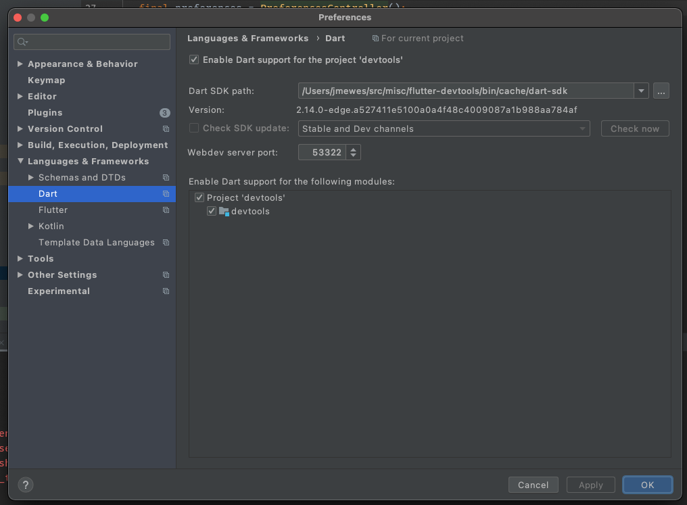

This blog post describes how to start the Devtools from Android Studio with a debugger attached.


## Create copy of devtools

```
cd -r ~/src/misc/flutter ~/src/misc/flutter-devtools
export PATH="/Users/jmewes/src/misc/flutter-devtools/bin:$PATH"

flutter downgrade v2.10.0
```



## Activate devtools as global package

```
cd packages/devtools
dart pub global activate --source path .
```


## References

- https://stackoverflow.com/questions/55783494/how-to-use-two-version-of-flutter-on-same-device-for-different-projects
- https://dartcode.org/docs/quickly-switching-between-sdk-versions/
- https://stackoverflow.com/questions/49468321/how-to-downgrade-flutter-sdk-dart-1-x
- https://dart.dev/tools/pub/cmd/pub-global
