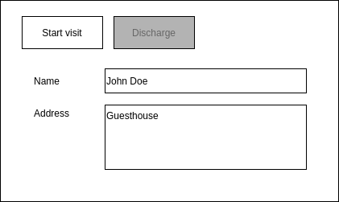
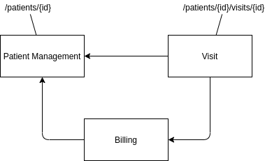
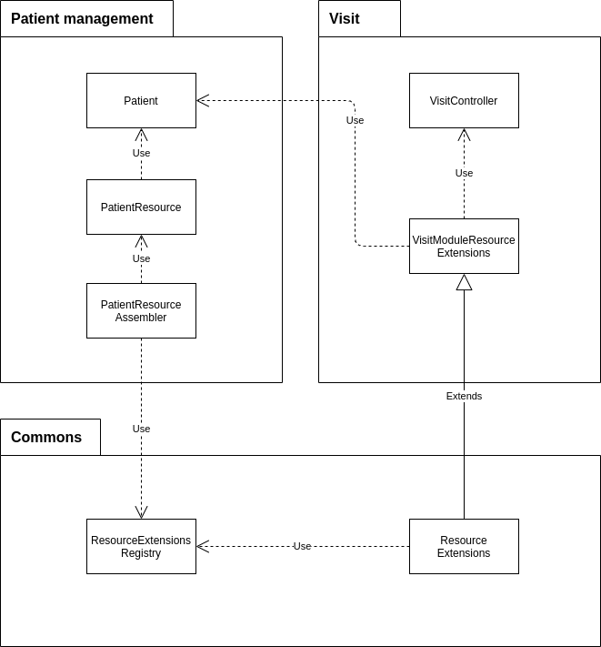

#java #spring #showdev

This blog post describes a concept for adding a link to a REST resource provided by a module A to a REST resource provided by module B without a dependeny from A to B. The example implementation uses Spring Boot and Spring HATEOAS.

## Context

The final goal is to render a screen about patient details. Beside editing the actual patient details like the patient's name and address, it should be possible to perform certain patient-related actions. Which actions can be performed depends the application state. For example, patients can only be discharged if they are currently admitted and they have paid their bills.



## REST API

When the app opens the patient details page, it executes the following HTTP request to receive the required data:

```text
GET /patients/{patientId}
```

The actions which can be done on the patient details page depend on the application state. Following the [HATEOAS](https://www.youtube.com/watch?v=_-vglnEttLI) concept for REST API design, the application state is indicated to the frontend applications with hyperlinks.  

For example, it is only possible to start a new visit for patient if there is no active visit, yet. So right after the creation of a new patient, the patient resource contains a "start-visit" in the "_links" section.

```json
{
  "_id": "0a3949db-b2c4-4a8e-8ec4-5470f9a3e89e",
  "name": "John Doe",
  "address": "Guesthouse",
  "_links": {
    "self": {
      "href": "http://localhost:8080/api/patients/0a3949db-b2c4-4a8e-8ec4-5470f9a3e89e"
    },
    "start-visit": {
      "href": "http://localhost:8080/api/patients/0a3949db-b2c4-4a8e-8ec4-5470f9a3e89e/visits"
    }
  }
}
```

After the visit has been started, the "start-visit" link disappears from the patient resource. But if there are no open bills for the patient, the patient can be discharged via the "discharge" link.

```json
{
  "_id": "0a3949db-b2c4-4a8e-8ec4-5470f9a3e89e",
  "name": "John Doe",
  "address": "Guesthouse",
  "_links": {
    "self": {
      "href": "http://localhost:8080/api/patients/0a3949db-b2c4-4a8e-8ec4-5470f9a3e89e"
    },
    "discharge": {
      "href": "http://localhost:8080/api/patients/0a3949db-b2c4-4a8e-8ec4-5470f9a3e89e/visits/4fc13f43-41db-494c-a265-aca01c3ae2a4/discharge"
    }
  }
}
```

## Module structure

This scenario requires interaction between three modules of the hospital application: patient management, visit, and billing. The _patient management_ module takes care of the patient's master data, the _visit_ module takes care of the patient's journey through the hospital, and the _billing_ module takes care of all payment related things.

In order to keep the system's complexity low, circular dependencies should be avoided. So to support the requirements described above, the _visit_ module knows about the _patient management_ module and the _billing_ module. However, the _patient management_ module must not know neither about the _visit_ module nor about the _billing_ module.



## Dependency inversion

The way in which this can be achieved is that the class which takes care to create the patient resource, the `PatientResourceAssembler`, doesn't need to how _which_ links need to be added to the patient resource, but it only needs to know _that_ links need to be added.

So the `PatientResourceAssembler` requests from a central registry, the `ResourceExtensionsRegistry`, which links should be added to the REST resource representation of a `Patient` entity. Every module which has a dependency on the _patient management_ module can add resource extensions for the patient resource to that central registry. To simplify that process, all the resource extensions need to be declared in a class derived from `ResourceExtensions`.



## Implementation details

The following code snippet shows the part of `VisitModuleResourceExtensions` which registers a callback function for the `Patient` which is called whenever a REST resource for the `Patient` entity is requested. This is done with the help of the `registerLink` method provided by the base class `ResourceExtensions`.

```java
@Component
public class VisitModuleResourceExtensions extends ResourceExtensions {

    // ...

    @Override
    public void init() {
        registerLink(Patient.class, patient -> createStartVisitLink(patient));
    }

    // ...
}
```

Within the method `createStartVisitLink` it is looked up whether there is already a patient with an active visit present. If yes, the "start-visit" link is not needed and the method returns an empty result. If no, then then "start-visit" link is generated with the help of Spring HATEOAS which can infer the resource path from the respective REST controller class and method.

```java
private Optional<Link> createStartVisitLink(Patient patient) {
    if (visitRepository.hasActiveVisit(patient.getId())) {
        return Optional.empty();
    } else {
        var link = linkTo(methodOn(VisitController.class).startVisit(patient.getId())).withRel("start-visit");
        return Optional.of(link);
    }
}
```

The `ResourceExtensions` class then delates the link registration to the `ResourceExtensionsRegistry`. And it takes care to execute the registration process at the time of the application startup, with the help of Spring's `@PostConstruct` annotation which markes a method which is executed right after a Spring Bean has been created.

```java
@RequiredArgsConstructor
public abstract class ResourceExtensions {

    private final ResourceExtensionsRegistry resourceExtensionsRegistry;

    @PostConstruct
    protected abstract void init();

    protected final <T> void registerLink(Class<T> cls, Function<T, Optional<Link>> linkProvider) {
        resourceExtensionsRegistry.registerLink(cls, linkProvider);
    }
}
```

Finally, when the patient resource gets created, the required links are pulled from the extensions registry. By providing the patient entity to the `getLinks` method, the callback function described above can be called to generated the links dynamically.

```java
@Component
@RequiredArgsConstructor
class PatientResourceAssembler implements RepresentationModelAssembler<Patient, PatientResource> {

    private final ResourceExtensionsRegistry resourceExtensionsRegistry;

    @Override
    public PatientResource toModel(Patient patient) {
        var result = PatientResource.from(patient);
        // ...
        result.add(resourceExtensionsRegistry.getLinks(Patient.class, patient));
        return result;
    }
}
```

## References

- [What is HATEOAS? and Why it is important for the REST API?](https://www.youtube.com/watch?v=_-vglnEttLI) | Ram N Java | youtube.com
- https://restfulapi.net/hateoas/
- https://www.baeldung.com/spring-hateoas-tutorial
